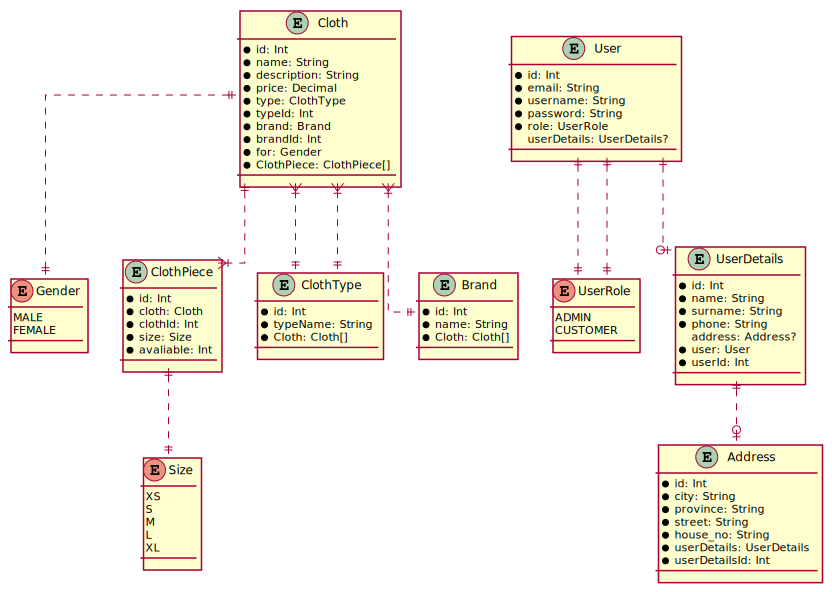

# Dokumentacja projektu (draft)

### Autorzy (+funkcje)

Michał Czyż **(MC)**

- backend
- frontend

Wojciech Ładyga **(WŁ)**

- backend
- frontend
- scrum master

### Technologie

- frontend -> react
- backend -> node.js
- baza danych -> relacyjna baza danych (Postgres)

### a. Identyfikacja zagadnienia biznesowego

Współcześnie większość handlu detalicznego odbywa się poprzez Internet. Lecz są branże, której sprzedaż nadal w większości dominuje w formie klasycznej. Są to między innymi sklepy odzieżowe. Jednak trend powoli zaczyna się odwracać i powstaje oraz więcej sklepów sprzedających ubrania poprzez sieć.
Wychodząc naprzeciw wymaganiom rynku nasz zespół zaprojektuje i wdroży sklep internetowy z odzieżą oparty o najnowsze i aktualne trendy technologiczne.
Sklep oferować będzie produkty dla każdej osoby, której celem będzie zakupienie nowej części garderoby. Nie stawia żadnych wymagań dotyczących płci i wieku, więc każdy znajdzie coś dla siebie od dynamicznego 13-latka po 100-latka.
Nowoczesny i prosty design pozwoli korzystać ze sklepu nawet osobą z podstawowymi umiejętnościami komputerowymi. Równocześnie stawia podstawowe wymagania jakimi jest dostęp użytkownika do urządzeń elektronicznych podpiętych do Internetu.

### b. Wymagania systemowe i funkcjonalne

Współczesny sklep Internetowy musi zawiera szereg funkcjonalności aby móc przyciągnąć do siebie klienta. Funkcjonalności zawarte w projekcie to:

- System autoryzacji użytkownika
- Wybór wielu sposobów płatności
- Wybór wielu sposobów dostawy towaru
- Formularz pozwalający o ubieganie się zwrotu pieniędzy za produkt
- Sekcja z ocenami produktu
- Sekcja z komentarzami na temat produktu
- Koszyk z produktami, pozwalający na późniejsze zawarcie transakcji
- Potwierdzenie zawarcia transakcji emailem
- System sortowania produktów pod względem
  - Ceny
  - Opinie
- System filtrowania produktów
  - Rodzaj odzieży (buty, koszulki, itp.)
  - Pod względem płci
  - Marki
- System wystawiania oceny produktowi
- System wystawiania komentarza pod produktem

Wymagania systemie:  
Aplikacja ta jest aplikacją internetową opartą o architekturę REST. Zbudowana jest z 2 modułów. Modułu backendowego opartego o node.js i modułu frontendowego wykorzystującego bibliotekę react. Komunikacja między modułami wykorzystuje protokół http. Dane przesyłane są w formacie JSON i korzystają z metod oferowanych przez http w celu wykonywania odpowiednich akcji po obu stronach aplikacji.
Dodatkowo aby zasilić aplikację danymi i przechowywać dane użytkownika została wykorzystana baza danych Postgres. Jest to relacyjna baza danych zapewniająca jednolitość i bezpieczeństwo danych klientów.

### c. Harmonogram prac

Projekt został podzielony na 4 główne etapy kończące się zrealizowaniem pewnych funkcjonalności biznesowych. Każda funkcjonalność podsumowana jest kamieniem milowym określającym zakończenie etapu i realizację założonych zadań/tasków.

#### Harmonogram prac (kamienie milowe + taski + termin zakończenia pracy):

1. Stworzenie mechanizmu logowania i rejestracji **(30 V)**

- Stworzenie formatek logowania i rejestracji **(WŁ)**
- Obsługa mechanizmu logowania/rejestracji na backendzie wraz z obsługą tokenu JWT **(WŁ)**
- Stworzenie modelu użytkownika dla bazy danych **(MC)**
- Stworzenie api do rejestracji/logowania **(MC)**
- Zarządzanie tokenem JWT po stronie backendu **(MC)**

2. Implementacja modułu pozwalającego na przeglądanie ubrań **(14 VI)**

- Stworzenie modelu ubrań, marki itp. dla bazy danych  **(MC)**
- Implementacja api do pobierania kolekcji ubrań/pojedynczego ubrania **(MC)**
- Stworzenie widoku dla konkretnego ubrania **(MC)**
- Obsługa filtrów/paginacji po stronie backendu **(WŁ)**
- Obsługa filtrów/paginacji na froncie (strona z wyborem ubrań) **(MC)(WŁ)**

3. Stworzenie mechanizmu składania i realizacji zamówienia **(21 VI)**

- Stworzenie modelu reprezentującego zamówienia na bazie danych **(MC)**
- Stworzenie widoku zamówienia, płatności i koszyka **(MC)(WŁ)**
- Stworzenie api do obsługi zamówienia, płatności **(WŁ)**

4. Implementacja panelu administratora **(28 VI)**

- Implementacja widoku panelu administratora **(WŁ)**
- Api umożliwiające na dodwanie nowych produktów **(WŁ)**

#### **Definition of Done** dla kamieni milowych:

1. Użytkownik zakłada konto na stronie ”StudenckieUbranka”. Po stworzeniu konta użytkownik loguje się.
2. Użytkownik zalogowany/niezalogowany ma możliwość przeglądania asortymentu sklepu przeglądając kolejne strony oraz stosując dostępne filtry. Po kliknięciu na interesujący produkt dostaje stronę ze szczegółami związanymi z produktem.
3. Użytkownik przeglądając asortyment dodaje produkty do koszyka. Następnie realizuje zamówienie podając wymagane dane.
4. Administrator/pracownik sklepu loguje się na swoje konto i ma możliwość dodania nowego produktu do kolekcji lub uzupełnienia braków w asortymencie.

### d. Analiza zagadnienia i jego modelowanie

#### Schemat uml bazy danych

#### Lista endpointów serwowanych przez backend:

- POST /api/user/login - endpoint do logowania
- POST /api/user/register - endpoint do rejestracji
- GET /api/user/:id - endpoint do pobrania użytkownika

- GET /api/page/:page_nr - pobranie konkretnej strony z przepisami
- GET /api/page/:page_nr?category=category&sex=sex&brands=[brand1,..]&from=from&to=to&sortBy=sortBy	- pobranie strony z przepisami z opcją sortowania i filtrowania
  - page_nr – pobranie konkretnej strony z produktami
  - category – sortowanie po kategorii
  - sex – posortowanie o płci
  - brands – pobranie konkretnej listy marek
  - from,to – zawężenie cen pomiędzy 2 wartości
  - sortBy – sortowanie malejąco/rosnąc

- GET /api/product/:id - pobranie produktu o konkretnym id
- GET /api/product - pobranie listy produktów
- POST /api/product/add	- dodanie nowego produktu do bazy przez administratora

-GET	/api/brand/all		- pobranie wszystkich marek
-GET	/api/category/all	- pobranie wszystkich dostępnych kategorii
-GET 	/api/images/:id	- pobranie obrazków konkretnego produktu
-GET 	/api/images/:id?width=width&height=height	- pobranie obrazków konkretnego produktu o odpowiedniej wielkości
-POST	/api/order		- zapisanie zamówienia użytkownika

### e. Implementacja i testowanie

  Testowanie:

Projekt po stronie backendu jak i frontendu był na bieżąco testowany przez każdego developera z wykorzystaniem głównie testów manualnych oraz prostych testów jednostkowych, które nie zostały dołączone do finalnego projektu.
Jednakże testy developerskie nie zawsze pozwolą przetestować w pełni kod i wychwycić wszystkie błędy. Dlatego program został przetestowany przez zewnętrzne osoby w celach wyeliminowania błędów niewidocznych dla developerów. Przez to aktualna implementacja nie posiada dużych błędów utrudniających z korzystania wszystkich dostępnych funkcjonalności udostępnionych w programie.
Oprócz samego procesu testowania w projekcie zastosowaliśmy metodykę dotyczącą code review. Każdorazowo nowa funkcjonalność stworzona przez członka zespołu była poddana inspekcji kodu. Takie działanie miało na celu poprawienie przejrzystości kodu jak wyeliminowanie błędów, które osoba tworząca kod mogła nie zauważyć. 

  Dodatkowe ciekawe narzędzia:

W projekcie została wykorzystana relacyjna baza danych. Taki typ bazy ma wiele plusów ale również parę minusów. Jednym z nich jest wymagane zastosowanie ORM-a, który ma za zadanie mapować dane przetwarzane przez frontend w formie JSON-a na tablicową strukturę relacyjnej bazy danych. W tym celu zastało wykorzystane narzędzie „prisma” https://www.prisma.io/. Zaletą tego narzędzia jest proste tworzenie zapytań do bazy danych opartych o format JSON, dzięki temu dane przychodzące z frontu łatwo są przekazywane do bazy danych.
Inną funkcjonalnością oferowaną przez to narzędzie jest narzędzie do seed-owania. Jet to proces pozwalający zasilić bazę danych danymi zapianymi w formacie JSON.
Ale jedną z najważniejszych zalet prismy jest jej przejrzystość. Generowany schemat bazy danych jest odpowiedni mapowany na bazy relacyjne i umożliwia w prosty sposób budować relacje między tabelami, a dodatkowo prosta struktura jest łata do zrozumienia nawet przez człowieka.

### f. Podsumowanie

Większość założeń projektu została zrealizowana. Jednakże nie wszystkie funkcjonalności udało się nam zaimplementować. Tą funkcjonalnością jest panel admina, który nie otrzymał wszystkich założonych z góry możliwości. Aktualnie administrator systemu może dodać nowy produkt do bazy danych. Jednakże nie ma możliwości na zarządzanie już dodanymi produktami poprzez ich edycję, usunięcie itp. Jest to jedna z funkcji, która może zostać w przyszłości całkowicie zaimplementowana.
Oczywiście projekt ten daje wiele możliwości dotyczących przyszłego rozwoju. Jednym z pomysłów jest całkowicie dostosowanie projektu do urządzeń mobilnych. Aktualia implementacja nie spełnia całkowicie podejścia mobile first, które jest dzisiaj tak bardzo pożądane. Inną funkcjonalnością , którą warto byłoby dodać jest możliwość logowania użytkownika poprzez  oAuth2 z wykorzystaniem np. googla lub innych popularnych usług.
Ciekawą opcją wartą do rozważenia jest wysyłanie maili z wygenerowaną fakturą po zakończeniu procesu zakupu. Zalążek tej funkcjonalności istnieje i polega na zapisie zamówienia do bazy danych. Jednakże warto by było rozwinąć tą funkcję.
Sama implementacja większości funkcjonalności nie sprawiła nikomu zbyt dużych trafności. Jednak środowisko uruchomieniowe jakim jest node.js nie posiada klarownych i łatwych w użyciu modułów pozwalających odbierać złożone dane jak np. plik JSON z danymi i obrazki. I implementacja modułu dodawania produktu przez administratora wymaga przesłania od 2 do 4 zdjęć i pliku z danymi. Front nie robi problemu z takimi danymi ale node.js  wymaka wykorzystania szeregu paserów i niepotrzebnego kodu w celu poprawnej interpretacji przesłanych danych.
Podsumowując projekt został zrealizowany i spełnia większość postawionych założeń. Jednocześnie jest to projekt, który ma duży potencjał przed sobą. I wiele ciekawych funkcjonalności można jeszcze do niego dodać. Jednocześnie w przyszłości warto by było umieścić ten projekt na jednej z dostępnych chmur.
